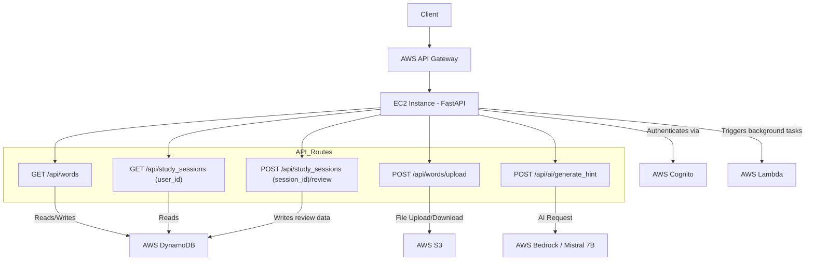

# Backend Server Technical Specs

## **1. Business Goal**

The backend server will power a **language learning platform** for teachers and students. It will support:

- **Vocabulary Inventory**: Stores and manages vocabulary words.
- **Learning Record Store (LRS)**: Tracks students’ study sessions and progress.
- **AI-Powered Learning**: Uses **Mistral 7B & AWS Bedrock** for smart recommendations and NLP.
- **Secure Authentication**: AWS Cognito for user management.
- **Scalable Serverless Architecture**: API Gateway, Lambda, DynamoDB, and S3 for efficient resource use.

---

## **2. Technical Requirements**

- **Backend Framework**: **FastAPI** (Python)
- **Hosting**: **AWS EC2** (for FastAPI), API Gateway for routing
- **Database**: **AWS DynamoDB** (NoSQL)
- **Storage**: **AWS S3** (for vocabulary images, audio)
- **Authentication**: **AWS Cognito** (for user management)
- **AI Processing**: **Mistral 7B (Hugging Face) & AWS Bedrock**
- **Task Automation**: **AWS Lambda** (for file processing, event triggers)

---

## **3. Directory Structure**

```
backend_fastapi/
├── app/
│   ├── models/          # DynamoDB ORM Models
│   ├── routers/         # API Route Handlers
│   ├── services/        # Business Logic & Integrations (AI, S3, etc.)
│   ├── auth/            # AWS Cognito Authentication
│   ├── utils/           # Helper Functions
├── scripts/
│   ├── seed_data.py     # Script to seed DynamoDB from S3 JSON
│   ├── s3_upload.py     # Script to upload files to S3
├── tests/               # API Tests
├── main.py              # FastAPI Entry Point
├── requirements.txt     # Python Dependencies
├── Dockerfile           # Docker Config (for EC2)
└── terraform/           # AWS Infrastructure as Code
```

---

## **4. API Endpoints**

### **1️⃣ GET /api/words**

**Description**: Fetch paginated vocabulary words from **DynamoDB**.

#### **JSON Response**

```json
{
  "items": [
    {
      "id": "1",
      "japanese": "こんにちは",
      "romaji": "konnichiwa",
      "english": "hello",
      "media_url": "https://s3.amazonaws.com/langportal/words/1.mp3"
    }
  ],
  "pagination": {
    "current_page": 1,
    "total_pages": 5,
    "total_items": 100,
    "items_per_page": 20
  }
}
```

---

### **2️⃣ GET /api/study_sessions/{user_id}**

**Description**: Retrieve study session history for a specific user.

#### **JSON Response**

```json
{
  "user_id": "abc123",
  "study_sessions": [
    {
      "id": "789",
      "group_name": "Basic Greetings",
      "start_time": "2025-02-08T17:20:23-05:00",
      "end_time": "2025-02-08T17:30:23-05:00",
      "review_items_count": 15,
      "success_rate": 80.0
    }
  ]
}
```

---

### **3️⃣ POST /api/words/upload**

**Description**: Uploads a vocabulary media file (image/audio) to **S3**.

#### **Request (multipart/form-data)**

```json
{
  "file": "<binary>",
  "word_id": "123"
}
```

#### **JSON Response**

```json
{
  "success": true,
  "file_url": "https://s3.amazonaws.com/langportal/words/123.mp3"
}
```

---

### **4️⃣ POST /api/ai/generate_hint**

**Description**: Uses **Mistral 7B** to generate **AI-powered learning hints** for a word.

#### **Request Payload**

```json
{
  "word": "こんにちは",
  "context": "Basic Greetings"
}
```

#### **JSON Response**

```json
{
  "word": "こんにちは",
  "romaji": "konnichiwa",
  "english": "hello",
  "ai_hint": "A common Japanese greeting used during the day."
}
```

---

### **5️⃣ POST /api/study_sessions/{session_id}/review**

**Description**: Logs a user’s answer (correct or incorrect) in **DynamoDB**.

#### **Request Payload**

```json
{
  "word_id": "1",
  "correct": true
}
```

#### **JSON Response**

```json
{
  "success": true,
  "session_id": "789",
  "word_id": "1",
  "correct": true
}
```

---

## **5. AWS Infrastructure**

| **Component**      | **AWS Service**          | **Role**                                   |
| ------------------ | ------------------------ | ------------------------------------------ |
| **API Gateway**    | AWS API Gateway          | Routes HTTP requests to FastAPI            |
| **Authentication** | AWS Cognito              | Handles user login/authentication          |
| **Compute**        | EC2 + Lambda             | Runs FastAPI backend and background tasks  |
| **Database**       | AWS DynamoDB             | Stores words, study sessions, and progress |
| **Storage**        | AWS S3                   | Stores vocabulary media files              |
| **AI Processing**  | Mistral 7B + AWS Bedrock | NLP-based learning hints                   |
| **Event Triggers** | AWS Lambda               | File processing, study streak resets       |

---

## **6. Architecture Diagram**

The following diagram illustrates how the FastAPI routes interact with the various AWS services:



### Diagram Explanation

- **Client to API Gateway**: All client requests go through AWS API Gateway.
- **API Gateway to FastAPI (EC2)**: API Gateway routes requests to the FastAPI application running on an EC2 instance.
- **FastAPI Routes**:
  - **GET /api/words** and **GET /api/study_sessions/{user_id}** interact with **DynamoDB** for fetching vocabulary and session data.
  - **POST /api/words/upload** sends files to **S3** for storage.
  - **POST /api/ai/generate_hint** calls the **Mistral 7B / AWS Bedrock** service for AI-driven hints.
  - **POST /api/study_sessions/{session_id}/review** logs review data into **DynamoDB**.
- **Authentication**: FastAPI uses AWS Cognito for managing user authentication.
- **Background Processing**: AWS Lambda functions are triggered for asynchronous tasks like file processing or scheduled operations.
