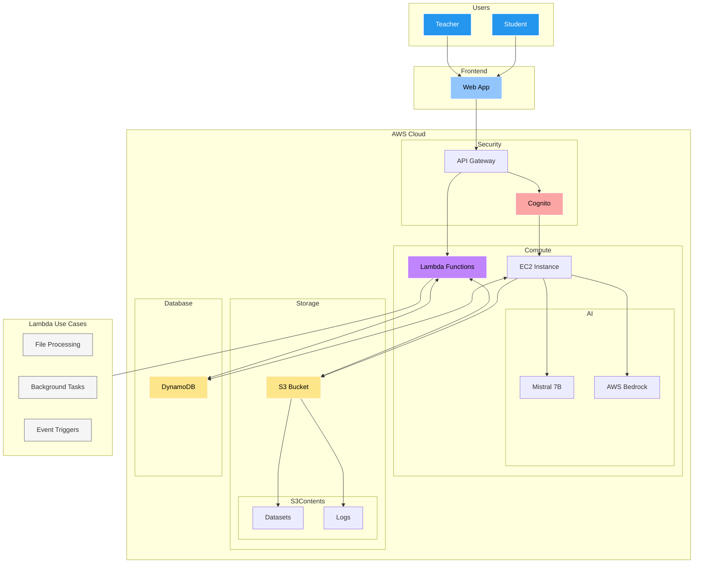

```mermaid
flowchart TB
    subgraph Users
        U1[Student]
        U2[Teacher]
    end

    subgraph Frontend
        Web[Web App]
    end

    subgraph AWS Cloud
        subgraph Security
            AG[API Gateway]
            COG[Cognito]
        end

        subgraph Compute
            EC2[EC2 Instance]
            subgraph AI
                M7B[Mistral 7B]
                BED[AWS Bedrock]
            end
            LMB[Lambda Functions]
        end

        subgraph Storage
            S3[S3 Bucket]
            subgraph S3Contents
                DS[Datasets]
                LOG[Logs]
            end
        end

        subgraph Database
            DDB[DynamoDB]
        end
    end

    %% Connections
    U1 & U2 --> Web
    Web --> AG
    AG --> COG
    AG --> LMB
    COG --> EC2
    EC2 --> M7B & BED
    EC2 --> S3
    S3 --> DS & LOG
    EC2 <--> DDB
    LMB <--> DDB
    LMB <--> S3

    %% Adding notes for Lambda use cases
    subgraph LambdaUses[Lambda Use Cases]
        L1[File Processing]
        L2[Background Tasks]
        L3[Event Triggers]
    end
    LMB --- LambdaUses

    %% Styling
    classDef primary fill:#2496ed,stroke:#fff,stroke-width:2px,color:#fff
    classDef secondary fill:#93c5fd,stroke:#fff,stroke-width:1px,color:#000
    classDef storage fill:#fde68a,stroke:#fff,stroke-width:1px,color:#000
    classDef security fill:#fca5a5,stroke:#fff,stroke-width:1px,color:#000
    classDef lambda fill:#c084fc,stroke:#fff,stroke-width:1px,color:#000
    classDef notes fill:#f5f5f5,stroke:#666,stroke-width:1px,color:#333

    class U1,U2 primary
    class Web secondary
    class S3,DDB storage
    class COG security
    class LMB lambda
    class L1,L2,L3 notes

```
